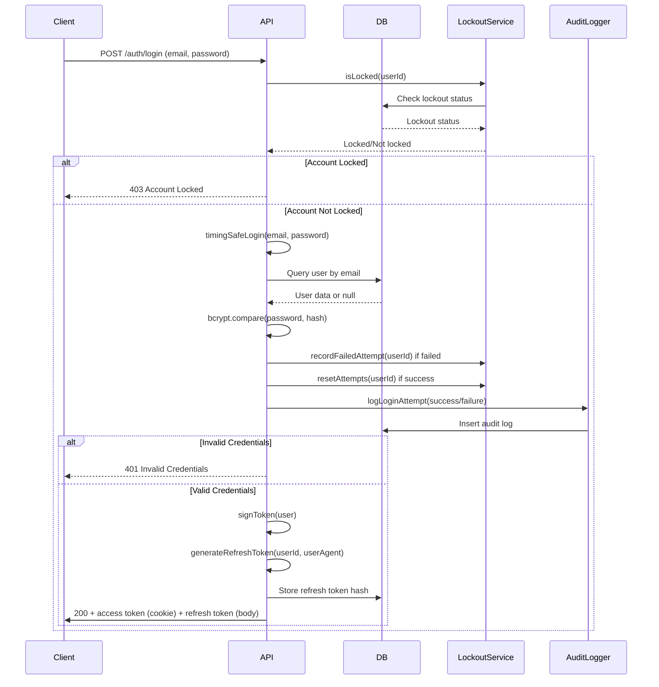
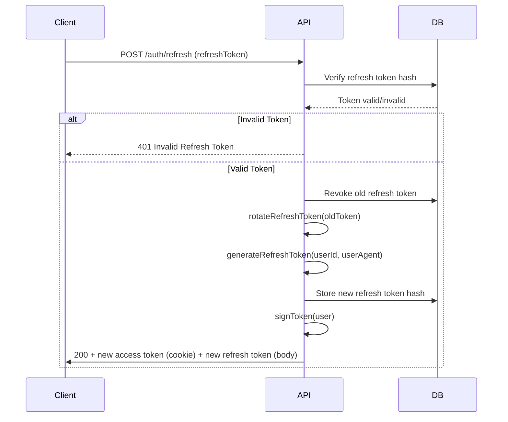
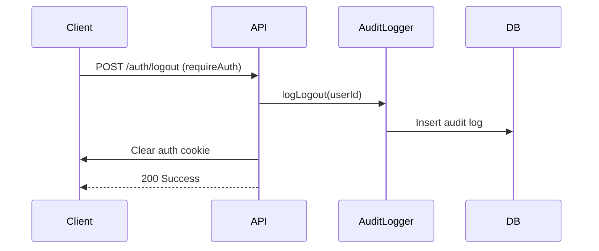

# Authentication Architecture

This document describes the authentication architecture for SpaFlow, including security decisions, token management, and implementation details.

## Overview

SpaFlow uses a JWT-based authentication system with refresh token rotation, following OWASP and industry best practices for 2025-2026 security standards. The system provides secure user authentication with timing-safe login, account lockout, audit logging, and session management.

### Key Security Features

- **JWT Access Tokens**: Short-lived (15 minutes) access tokens stored in HttpOnly cookies
- **Refresh Token Rotation**: Long-lived (7 days) refresh tokens with automatic rotation on each use
- **Timing-Safe Authentication**: Prevents user enumeration via timing attacks
- **Account Lockout**: Configurable lockout after N failed login attempts
- **Audit Logging**: All authentication events logged with correlation IDs
- **Password Reset**: Secure password reset flow with single-use tokens
- **Session Management**: Users can view and revoke active sessions

## Authentication Flow

### Login Flow



### Login Process Details

1. **Request Validation**: Email and password validated using Zod schema
2. **Rate Limiting**: IP-based rate limiting (5 attempts/15 minutes) applied
3. **Lockout Check**: Account lockout status checked before password verification
4. **Timing-Safe Login**: 
   - Database query always executed (even if user doesn't exist)
   - Password comparison uses dummy hash for non-existent users
   - Random delay (0-100ms) added to normalize response times
5. **Password Verification**: bcrypt.compare (timing-safe)
6. **Lockout Management**: Failed attempts tracked, account locked after threshold
7. **Audit Logging**: Login attempt logged with IP, email, success/failure, correlation ID
8. **Token Generation**: 
   - JWT access token signed with HS256 algorithm
   - Refresh token generated (32 bytes, 256 bits entropy)
   - Refresh token hash stored in database
9. **Response**: Access token in HttpOnly cookie, refresh token in response body

### Token Refresh Flow



### Refresh Token Process Details

1. **Token Verification**: Refresh token hash looked up in database
2. **Expiration Check**: Token rejected if expired
3. **Token Rotation**: 
   - Old token immediately revoked
   - New token generated with same user agent
   - Prevents replay attacks
4. **Access Token Generation**: New JWT signed for user
5. **Response**: New access token in cookie, new refresh token in body

### Logout Flow



## Token Management

### Access Token (JWT)

- **Algorithm**: HS256 (HMAC-SHA256)
- **Secret**: Configured via `JWT_SECRET` environment variable (minimum 32 characters)
- **Expiry**: 15 minutes (configurable via `JWT_EXPIRY`)
- **Storage**: HttpOnly cookie (not accessible to JavaScript)
- **Claims**:
  - `sub`: User ID (as string)
  - `email`: User email
  - `role`: User role (STAFF or MANAGER)
  - `name`: User name
  - `iat`: Issued at timestamp
  - `exp`: Expiration timestamp

### Refresh Token

- **Generation**: Cryptographically random (32 bytes = 256 bits entropy)
- **Storage**: Hashed in database (bcrypt)
- **Expiry**: 7 days (configurable via `REFRESH_TOKEN_EXPIRY_DAYS`)
- **Rotation**: Automatic rotation on each use
- **Revocation**: Single-use, old token immediately revoked
- **User Agent**: Stored for session identification
- **Client Storage**: Client-side (localStorage or memory)

### Token Validation

Access tokens are validated on every protected request:
1. Token extracted from HttpOnly cookie
2. Signature verified using JWT secret
3. Claims validated using Zod schema
4. Expiration checked
5. Error logged with token hash (not full token for security)

## Security Decisions

### Why JWT?

**Decision**: Use JWT (JSON Web Tokens) for access tokens

**Rationale**:
- Stateless authentication reduces database load
- Easy to scale across multiple servers
- Industry standard with extensive library support
- Self-contained tokens include user claims
- Compatible with microservices architecture

**Trade-offs**:
- Tokens cannot be revoked before expiration (mitigated by short expiry)
- Requires careful secret management
- Token size larger than session IDs

**Alternatives Considered**:
- Session IDs with server-side storage: More secure but requires session store
- Stateful JWT with revocation list: Adds complexity and database queries

### Why Refresh Token Rotation?

**Decision**: Implement refresh token rotation on each use

**Rationale**:
- Prevents replay attacks if refresh token is stolen
- Limits damage window (old token immediately invalid)
- Industry best practice per Auth0, Curity, and OWASP
- Allows detection of token theft (multiple refresh attempts)

**Trade-offs**:
- Requires database query on each refresh
- More complex client-side logic
- Users may experience logout if token reused

**Alternatives Considered**:
- Static refresh tokens: Simpler but less secure
- No refresh tokens: Forces frequent re-login (poor UX)

### Why HttpOnly Cookies for Access Tokens?

**Decision**: Store access tokens in HttpOnly cookies

**Rationale**:
- Prevents XSS attacks from stealing tokens
- Automatic inclusion in requests
- No need for manual Authorization header
- Recommended by Duende Software and OWASP

**Trade-offs**:
- Vulnerable to CSRF (mitigated by SameSite=strict)
- Cannot manually include in cross-origin requests
- Less flexible for API clients

**Alternatives Considered**:
- Authorization header: More flexible but XSS vulnerable
- LocalStorage: XSS vulnerable

### Why bcrypt for Password Hashing?

**Decision**: Use bcrypt for password hashing

**Rationale**:
- Proven algorithm with adaptive cost factor
- Built-in salt prevents rainbow table attacks
- Recommended by OWASP for legacy systems
- Widely supported and battle-tested

**Trade-offs**:
- Slower than Argon2id (but acceptable)
- Less resistant to GPU-based attacks

**Alternatives Considered**:
- Argon2id: OWASP recommended but bcrypt acceptable for legacy
- PBKDF2: Similar to bcrypt, bcrypt chosen for familiarity

### Why Timing-Safe Login?

**Decision**: Implement timing-safe login to prevent user enumeration

**Rationale**:
- Prevents attackers from enumerating valid email addresses
- OWASP recommendation
- Simple to implement with dummy hash comparison
- Critical security requirement

**Trade-offs**:
- Slightly slower login (dummy comparison + random delay)
- More complex code

**Alternatives Considered**:
- Early return on user not found: Vulnerable to timing attacks
- Sleep-based delays: Ineffective, crypto-based timing is better

### Why Account Lockout?

**Decision**: Implement account lockout after N failed attempts

**Rationale**:
- Prevents brute force attacks
- OWASP recommendation
- Complements IP-based rate limiting
- Database-persisted state (not bypassable via IP rotation)

**Trade-offs**:
- Can be used for DoS (lock legitimate accounts)
- Requires manual unlock or time-based auto-unlock

**Alternatives Considered**:
- IP-only rate limiting: Bypassable via IP rotation
- CAPTCHA: More user friction, implemented as future enhancement

### Why NIST 2025 Password Requirements?

**Decision**: Follow NIST SP 800-63B Rev 4 (2025) password guidelines

**Rationale**:
- Minimum 15 characters (no mandatory complexity rules)
- Maximum 64 characters
- Supports spaces and Unicode
- User-friendly (no arbitrary composition rules)
- Latest federal standards

**Trade-offs**:
- Longer passwords may be harder for users to remember
- No complexity rules may reduce perceived security

**Alternatives Considered**:
- Traditional complexity rules: User-hostile, proven ineffective
- Shorter passwords: Less secure against brute force

## Rate Limiting

### IP-Based Rate Limiting

- **Endpoint**: `/auth/login`
- **Limit**: 5 attempts per 15 minutes per IP address
- **Implementation**: Express middleware with in-memory storage
- **Purpose**: Prevents brute force attacks from single IP

### Account Lockout Rate Limiting

- **Threshold**: Configurable (default: 5 failed attempts)
- **Duration**: Configurable (default: 15 minutes)
- **Scope**: Per user account (database-persisted)
- **Purpose**: Prevents credential stuffing across multiple IPs

## Audit Logging

### Events Logged

- **LOGIN_SUCCESS**: Successful login with user ID, email, IP, correlation ID
- **LOGIN_FAILURE**: Failed login with email, IP, reason, correlation ID
- **LOGOUT**: Logout event with user ID, IP, correlation ID

### Log Structure

- **Table**: `audit_logs`
- **Fields**: id, userId, action, resourceType, resourceId, description, ipAddress, email, correlationId, createdAt
- **Indexes**: userId, action, createdAt, correlationId for efficient queries

### Security Considerations

- Passwords never logged
- Token hashes logged (not full tokens)
- Sensitive data excluded from logs
- Correlation IDs for traceability across requests

## Session Management

### Active Sessions

- **Endpoint**: `GET /auth/sessions`
- **Returns**: List of active sessions with device/browser info
- **Current Session**: Marked in list
- **Access Control**: Users can only view their own sessions

### Revoke Session

- **Endpoint**: `DELETE /auth/sessions/:id`
- **Action**: Revokes specific refresh token
- **Protection**: Cannot revoke current session via API (must use logout)

### Revoke All Sessions

- **Endpoint**: `DELETE /auth/sessions`
- **Action**: Revokes all refresh tokens except current
- **Use Case**: Compromise response, logout from all devices

## Deployment Considerations

### Environment Variables

- `JWT_SECRET`: Secret key for JWT signing (minimum 32 characters)
- `JWT_EXPIRY`: Access token expiry (default: "15m")
- `REFRESH_TOKEN_EXPIRY_DAYS`: Refresh token expiry in days (default: 7)
- `COOKIE_NAME`: Cookie name for access token (default: "spaflow_session")
- `LOCKOUT_THRESHOLD`: Failed attempts before lockout (default: 5)
- `LOCKOUT_DURATION_MS`: Lockout duration in milliseconds (default: 900000)
- `NODE_ENV`: Environment (development/production)

### Production Requirements

- **HTTPS**: Required for secure cookie transmission
- **Secure Cookies**: HttpOnly and Secure flags set in production
- **SameSite**: Set to "strict" to prevent CSRF
- **Secret Management**: Use secure secret management (not hardcoded)
- **Database**: PostgreSQL with proper indexes for performance

### Development vs Production

- **Development**: Secure flag off on cookies (for HTTP)
- **Production**: Secure flag on, HTTPS required
- **Testing**: Use test database, shorter lockout duration

## Database Schema

### Users Table

```sql
CREATE TABLE users (
  id SERIAL PRIMARY KEY,
  email TEXT NOT NULL UNIQUE,
  name TEXT NOT NULL,
  password_hash TEXT NOT NULL,
  role TEXT NOT NULL DEFAULT 'STAFF',
  created_at TIMESTAMP WITH TIME ZONE NOT NULL DEFAULT NOW(),
  updated_at TIMESTAMP WITH TIME ZONE NOT NULL DEFAULT NOW(),
  failed_login_attempts INTEGER NOT NULL DEFAULT 0,
  locked_until TIMESTAMP WITH TIME ZONE,
  last_failed_login_at TIMESTAMP WITH TIME ZONE
);
```

### Refresh Tokens Table

```sql
CREATE TABLE refresh_tokens (
  id SERIAL PRIMARY KEY,
  user_id INTEGER NOT NULL REFERENCES users(id),
  token_hash TEXT NOT NULL UNIQUE,
  expires_at TIMESTAMP WITH TIME ZONE NOT NULL,
  created_at TIMESTAMP WITH TIME ZONE NOT NULL DEFAULT NOW(),
  revoked_at TIMESTAMP WITH TIME ZONE,
  replaced_by INTEGER,
  user_agent TEXT
);
```

### Audit Logs Table

```sql
CREATE TABLE audit_logs (
  id SERIAL PRIMARY KEY,
  user_id INTEGER REFERENCES users(id),
  action TEXT NOT NULL,
  resource_type TEXT NOT NULL,
  resource_id INTEGER,
  description TEXT,
  ip_address TEXT,
  email TEXT,
  correlation_id TEXT,
  created_at TIMESTAMP WITH TIME ZONE NOT NULL DEFAULT NOW()
);
```

## Architecture Decision Records

### ADR-001: JWT-Based Authentication

**Status**: Accepted

**Context**: Need stateless authentication system that scales across multiple servers

**Decision**: Use JWT access tokens with refresh token rotation

**Consequences**:
- Positive: Stateless, scalable, industry standard
- Negative: Cannot revoke tokens before expiry (mitigated by short expiry)

### ADR-002: HttpOnly Cookie Storage

**Status**: Accepted

**Context**: Need to prevent XSS attacks from stealing access tokens

**Decision**: Store access tokens in HttpOnly cookies

**Consequences**:
- Positive: XSS protection, automatic cookie inclusion
- Negative: CSRF risk (mitigated by SameSite=strict)

### ADR-003: Timing-Safe Authentication

**Status**: Accepted

**Context**: Need to prevent user enumeration via timing attacks

**Decision**: Implement timing-safe login with dummy hash comparison

**Consequences**:
- Positive: Prevents email enumeration, OWASP compliant
- Negative: Slightly slower login, more complex code

## References

- [OWASP Authentication Cheat Sheet](https://cheatsheetseries.owasp.org/cheatsheets/Authentication_Cheat_Sheet.html)
- [OWASP JSON Web Token for Java Cheat Sheet](https://cheatsheetseries.owasp.org/cheatsheets/JSON_Web_Token_for_Java_Cheat_Sheet.html)
- [Curity JWT Best Practices](https://curity.io/resources/learn/jwt-best-practices/)
- [NIST SP 800-63B Rev 4 (2025)](https://pages.nist.gov/800-63-4/)
- [Architecture Decision Records](https://github.com/joelparkerhenderson/architecture-decision-record)

## Future Enhancements

- **Argon2id Migration**: Consider migrating from bcrypt to Argon2id for password hashing
- **Device Fingerprinting**: Implement device-based lockout for smarter protection
- **CAPTCHA**: Add CAPTCHA for suspicious activity during high-volume attacks
- **Grace Period**: Implement 5-minute grace period for token expiration
- **EdDSA Algorithm**: Consider EdDSA for JWT signing (future enhancement)
- **Behavioral Analysis**: Monitor refresh token usage patterns for compromise detection
- **Compromised Password Blocklist**: Screen passwords against known compromised lists
